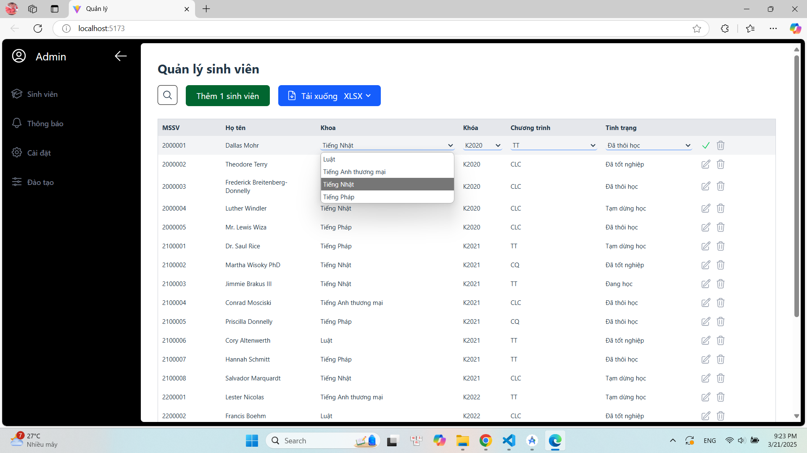
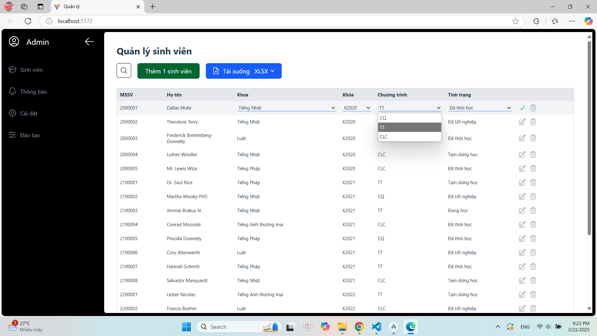
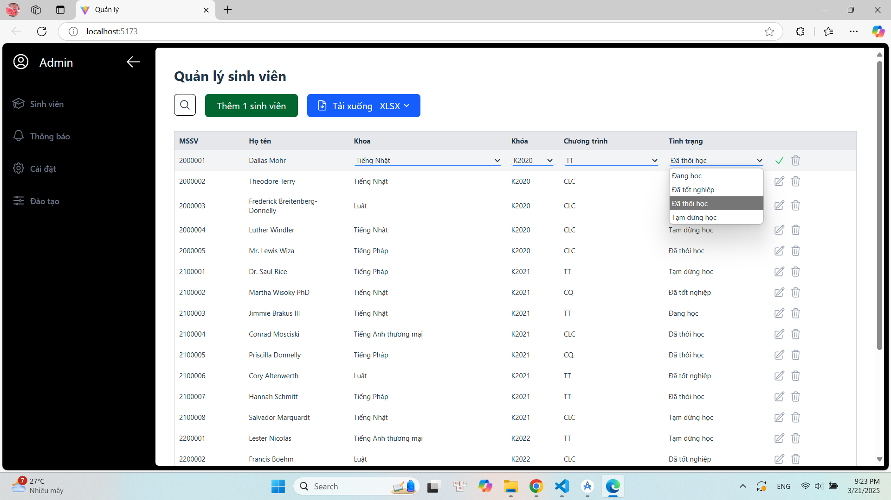
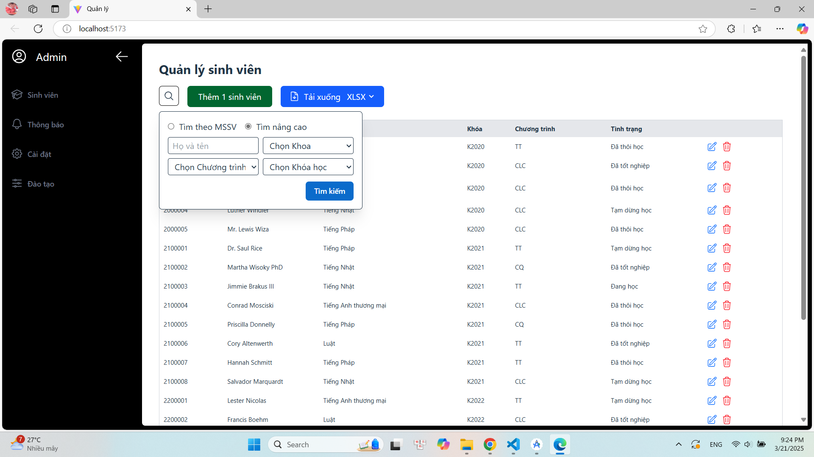
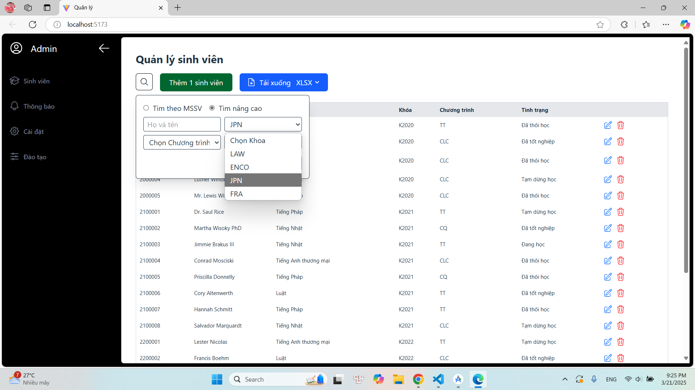
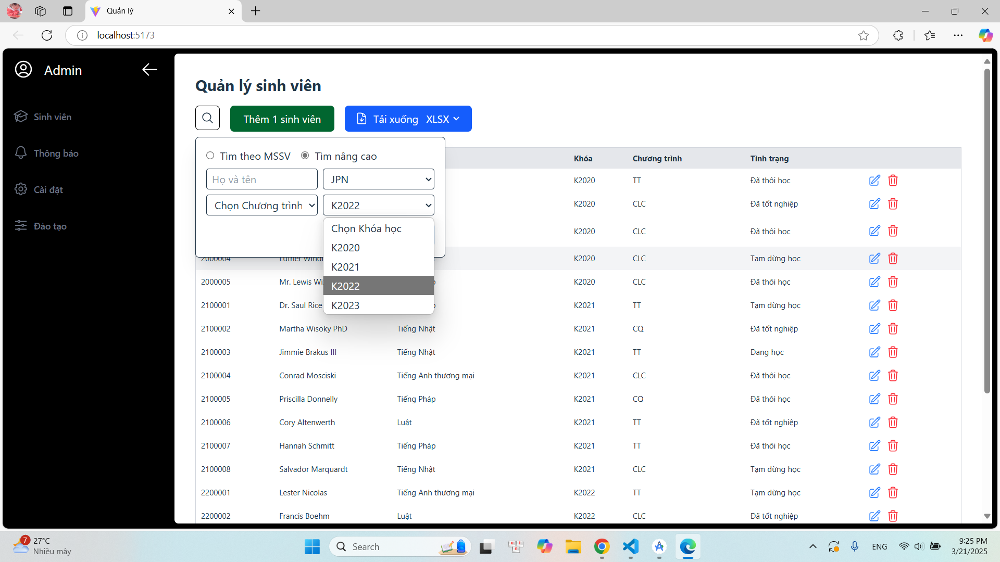
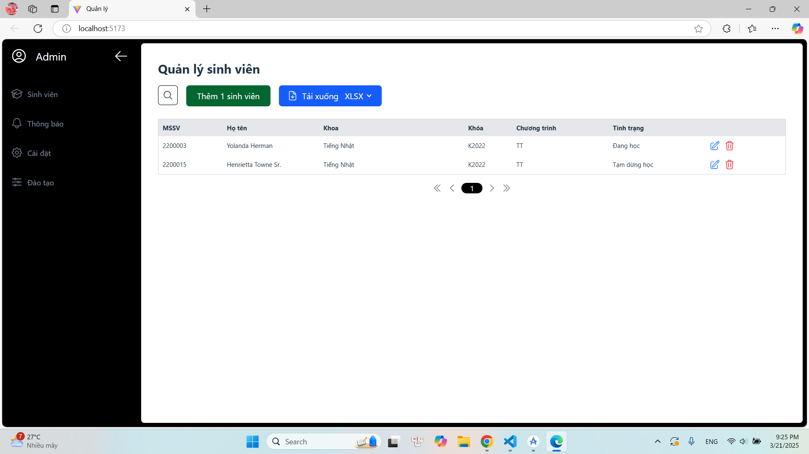
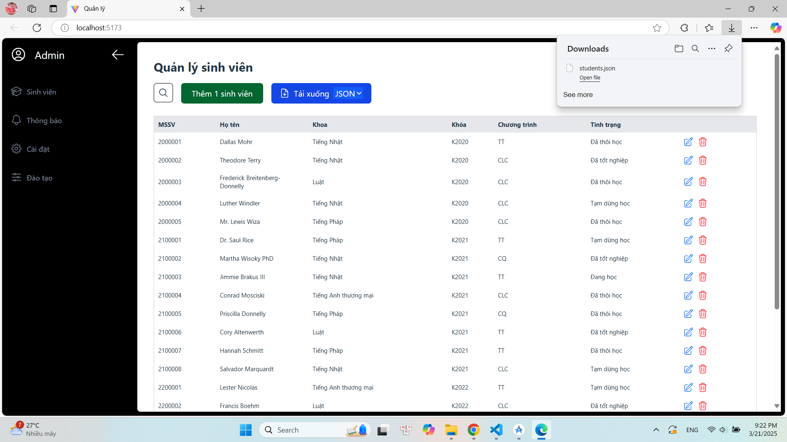
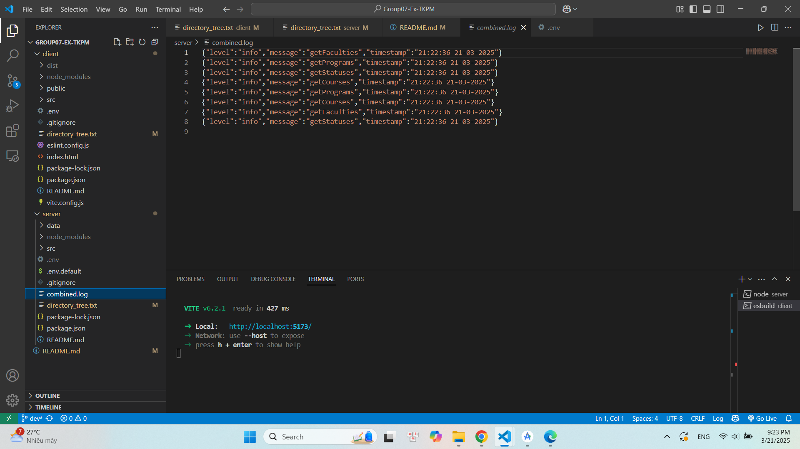

# Ex02_softwaredesign

## Cấu trúc source code

```
project-root
├── client
│   ├── .env
│   ├── .gitignore
│   ├── eslint.config.js
│   ├── vite.config.js
│   ├── index.html
│   ├── README.md
│   ├── directory_tree.txt
│   ├── package-lock.json
│   ├── package.json
│   ├── public
│   │   └── vite.svg
│   └── src
│       ├── api
│       │   ├── useCourses.js
│       │   ├── useFalcuties.js
│       │   ├── usePrograms.js
│       │   └── useStudents.js
│       ├── assets
│       │   └── react.svg
│       ├── components
│       │   └── sidebar.jsx
│       ├── pages
│       │   └── student.jsx
│       ├── utils
│       │   ├── axios.js
│       │   ├── ErrorContext.jsx
│       │   └── validators.js
│       ├── App.css
│       ├── App.jsx
│       ├── index.css
│       └── main.jsx
└── server
    ├── .env
    ├── .env.default
    ├── .gitignore
    ├── README.md
    ├── directory_tree.txt
    ├── package-lock.json
    ├── package.json
    ├── data
    │   ├── in
    │   │   └── students.csv
    │   └── out
    └── src
        ├── config
        │   └── database.js
        ├── middleware
        │   └── uploadMiddleware.js
        ├── modules
        │   ├── address
        │   │   ├── mailAddressModel.js
        │   │   ├── permanentAddressModel.js
        │   │   └── temporaryResidenceAddressModel.js
        │   ├── course
        │   │   ├── courseController.js
        │   │   ├── courseModel.js
        │   │   └── courseService.js
        │   ├── faculty
        │   │   ├── facultyController.js
        │   │   ├── facultyModel.js
        │   │   └── facultyService.js
        │   ├── import
        │   │   └── fileUploadService.js
        │   ├── nationality
        │   │   └── nationalityModel.js
        │   ├── program
        │   │   ├── programController.js
        │   │   ├── programModel.js
        │   │   └── programService.js
        │   └── student
        │       ├── nidCardModel.js
        │       ├── oidCardModel.js
        │       ├── passportModel.js
        │       ├── studentController.js
        │       ├── studentModel.js
        │       ├── studentService.js
        │       └── studentStatusModel.js
        ── route
        │   ├── courseRoute.js
        │   ├── facultyRoute.js
        │   ├── programRoute.js
        │   ├── studentRoute.js
        │   └── studentRoutes.js
        │
        ├── index.js        
        └── logger.js

25 directories, 63 files
```

## Hướng dẫn cài đặt và chạy chương trình
Cài đặt Node.js
Mở cửa sổ Terminal

1. **Cài đặt và chạy server**

    Di chuyển vào thư mục server
    ```bash
    cd server
    ```
    Cấu hình .env
    ```bash
    cp .env.default .env
    ```
    Sau đó, chỉnh sửa tệp .env với thông tin đăng nhập PostgreSQL và các chi tiết cấu hình khác.
    Cài đặt dependencies
    ```bash
    npm install
    ```
    Chạy server start
    ```bash
    npm run start
    ```

2. **Cài đặt và Chạy client**
    Di chuyển vào thư mục client
    ```bash
    cd client
    ```
    Cài đặt dependencies
    ```bash
    npm install
    ```
    Build project (tạo thư mục "dist")
    ```bash
    npm run build
    ```
    Chạy preview
    ```bash
    npm run dev
    ```

## Các tính năng:

1. Cho phép đổi tên & thêm mới: khoa, tình trạng sinh viên, chương trình

Thay đổi khoa


Thay đổi chương trình


Thay đổi tình trạng


2. Thêm chức năng tìm kiếm: tìm theo khoa, khoa + tên

Mở mục tìm kiếm nâng cao:


Chọn khoa


Chọn khóa học


Chọn chương trình


Kết quả


3. Export dữ liệu bằng file json/xslx

Export bằng file json:


Export bằng file xslx


4. Thêm logging mechanism để troubleshooting production issue & audit purposes




## Phiên bản 
```bash
v2.0
```