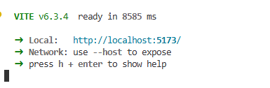
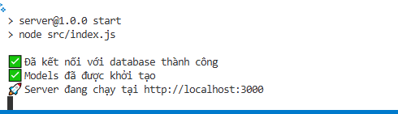

Student Management System
=========================
<details>
<summary>𝄜 <strong>Table of Contents</strong></summary>

- [Student Management System](#student-management-system)
- [1. 🗎 Project Title](#1--project-title)
- [2. ✍️ Description](#2-️-description)
  - [2.1. Our application help a academic staff:](#21-our-application-help-a-academic-staff)
  - [2.2. 🛠️ Technologies](#22-️-technologies)
- [3. ⚙️ Installation](#3-️-installation)
  - [3.1. 🔧 Step 1: Configure database](#31--step-1-configure-database)
  - [3.2. 🧩 Step 2: Install Libraries](#32--step-2-install-libraries)
  - [3.3. 🚀 Step 3: Start the Application](#33--step-3-start-the-application)
    - [3.3.1. Start the frontend (Vite)](#331-start-the-frontend-vite)
    - [3.3.2. Start the backend (Express)](#332-start-the-backend-express)
- [4. 📚 Development guide](#4--development-guide)

</details>

# 1. 🗎 Project Title
This is our course project for the Design Software subject.  
The project focuses on solving business logic related to school management, such as managing students, courses, classes, and class registrations.

Through this project, we have learned how to:
- Write clean and maintainable code
- Communicate effectively as a team through code
- Design a system that is easy to extend and improve    

# 2. ✍️ Description
## 2.1. Our application help a academic staff:
- Manage student information (view, create, update, delete, import, and export via file)
- Organize courses and classes, and handle class registrations (while ensuring compliance with data security requirements)
- Support bilingual interface (English and Vietnamese) for the static content
## 2.2. 🛠️ Technologies

💻 Frontend – User Interface (React + Vite + TypeScript)

- We use **React** with **Vite** to build the user interface. React is a modern library that supports component-based architecture and efficient state management. Vite provides a fast development experience and easy plugin integration. We also use the **TailwindCSS** plugin for styling.

📦 Backend – RESTful API (Node.js + Express + Sequelize + PostgreSQL)

- For the backend, we use a **Node.js (v20.17.0)** environment with the **Express** framework. Express offers a wide range of libraries for handling backend tasks and routing. We use **Sequelize** as the ORM to map data between our application and **Supabase**, a cloud-based PostgreSQL database platform.

# 3. ⚙️ Installation
## 3.1. 🔧 Step 1: Configure database

Use a cloud platform (e.g. [Supabase](https://supabase.com)) or a PostgresSQL app (e.g. pgAdmin4) to:

- Run [`schema.sql`](../documents/database/schema.sql) to set up table structures, triggers, policies.
- Run [`data.sql`](../documents/database/data.sql) to insert data.  
  _Note: If you encounter foreign key errors, consider reordering the data inserts manually._
- In `./server`, copy [`.env.default`](../server/.env.default) to `.env` and fill in appropriate parameters.

## 3.2. 🧩 Step 2: Install Libraries
Ensure that your device has Node.js installed (you can check by running node --version). Then, install the dependencies:

```bash
cd ./client
npm install
```

```bash
cd ../server
npm install
```


## 3.3. 🚀 Step 3: Start the Application
### 3.3.1. Start the frontend (Vite)
```bash
cd ./client
npm run dev
```
  
*You should see the Vite dev server running at http://localhost:5173*

### 3.3.2. Start the backend (Express)
```bash
cd ./server
npm start
```
  
*You should see a message like: Server is running on http://localhost:3000*

# 4. 📚 Development guide

- [Database Schema](documents/dev_guide/schema.svg)
- [Source code organization](documents/dev_guide/source_code_organization.md)
