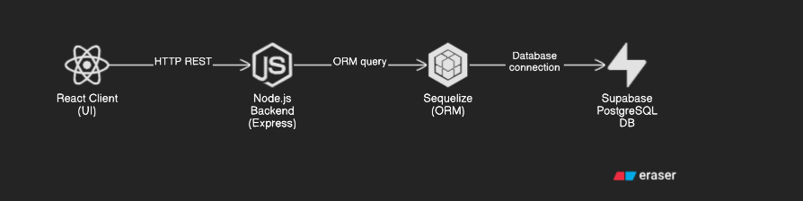

# Kiến trúc tổng quan hệ thống

## Cấu trúc thư mục chung

Dự án được chia thành hai phần chính: **Frontend** và **Backend**, đảm bảo phân tách rõ ràng giữa giao diện người dùng và xử lý logic phía máy chủ.

Giang hồ đồn là mô hình MC (không phải MVC).


---

## Frontend: React + TypeScript

- **Thư viện chính**: [ReactJS](https://reactjs.org/)
- **Ngôn ngữ**: TypeScript
- **CSS**: 
- **Quản lý state**: 
- **Giao tiếp API**: `fetch` (RESTful)

### Vai trò:
- Xử lý giao diện, hiển thị dữ liệu
- Gửi và nhận dữ liệu từ backend thông qua API
- Tối ưu hóa trải nghiệm người dùng (UX)

---

## Backend: NodeJS + Express + Sequelize

- **Môi trường**: Node.js
- **Framework**: ExpressJS
- **ORM**: [Sequelize](https://sequelize.org/) – tương tác với CSDL
- **Database**: PostgreSQL

### Cấu trúc chính:

| Thư mục        | Mô tả                                                                    |
| -------------- | ------------------------------------------------------------------------ |
| `controllers/` | Nhận và xử lý request từ client                                          |
| `models/`      | Khai báo schema của database qua Sequelize                               |
| `services/`    | Xử lý logic nghiệp vụ                                                    |
| `routes/`      | Định nghĩa các route API                                                 |
| `config/`      | Cấu hình DB, dotenv, middleware                                          |
| `middleware/`  | xử lý kiểm tra quyeernfe, JWT ... giữa client và server                  |
| `utils/`       | Các hàm tiện ích tái sử dụng như quăng lỗi validate dữ liệu ...          |
| `tests/`       | Unit test, kiểm tra các chức năng và khả năng hoạt động của tầng service |

---

## 🔗 Luồng hoạt động hệ thống

```mermaid
sequenceDiagram
  Người dùng->>+Frontend: Tương tác UI
  Frontend->>+Backend: Gửi API request (REST)
  Backend->>+CSDL: Truy vấn / ghi dữ liệu (Sequelize)
  CSDL-->>-Backend: Trả kết quả
  Backend-->>-Frontend: Trả JSON
  Frontend-->>-Người dùng: Hiển thị dữ liệu
